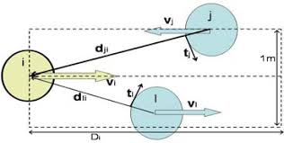
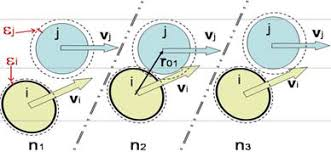

+++
title = "Simualazione di evacuazione di folle con micro-interazioni fisiche ed elementi cognitivi"
outputs = ["Reveal"]
+++

# Agenti cognitivi in Alchemist per la simulazione di evacuazioni di folle

## **Stato dell'arte**

---

# OVERVIEW

1. Modello del pedone cognitivo
    - Modello IMPACT
    - Il pedone cognitivo
    - Movimento del pedone cognitivo

2. Modello di mappa mentale per l'orientamento dei pedoni cognitivi
    - Grafo dell'ambiente e mappa cognitiva

3. Modello fisico del movimento del pedone cognitivo
    - Il modello HiDAC
    - Forze di evitamento e repulsione
    - Cadute e spinte

4. Simulazione Evacuazione di folla in Piazza San Carlo, Torino

---

# Modello del pedone cognitivo

[D. Mazzieri 2019](https://amslaurea.unibo.it/id/eprint/19084)

---

## Il modello IMPACT

* Nasce con l'obiettivo di non limitarsi alle sole leggi fisiche nella modellazione
di agenti ma considerare le caratteristiche socio-culturali nonché una componente emotiva
fortemente infuenzabile.

Ogni agente è contraddistinto da:
  * età (bambino, adulto, anziano); 
  * sesso (uomo, donna).

---

## Il modello IMPACT

* Le combinazioni di questi due attributi determinano un insieme di caratteristiche statiche e dinamiche.

* Le prime si mantengono tali per la durata della simulazione mentre le altre evolvono seguendo 
i principi del Network Oriented Modelling

<table>
    <tr>
        <th colspan="2">Caratteristiche</th>
    </tr>
    <tr>
        <td>STATICHE</td>
        <td>ATTIVE</td>
    </tr>
    <tr>
        <td>
            <ul>
                <li>Velocità</li>
                <li>Conformità alle regole</li>
                <li>Attidudine ad aituare</li>
            </ul>
        </td>
        <td>
            <ul>
                <li>Sensazione di pericolo</li>
                <li>Paura</li>
                <li>Desiderio/Intenzione di fuggire</li>
                <li>Desiderio/Intenzione di non fuggire</li>
            </ul>
        </td>
    </tr>
</table>

--- 

## Il pedone cognitivo

Esistono tre livelli di dettaglio nella rappresentazione di un pedone:

* **Pedone omogeneo**: pedone con una velocita predefinita di camminata e di corsa uguale per tutti;

* **Pedone eterogeneo**: pedone con un sesso e un eta assegnati, dai quali saranno determinate velocità,
conformità alle regole e attitudine ad aiutare;

* **Pedone cognitivo**: pedone eterogeneo con delle emozioni, capace di influenzare e farsi 
influenzare dagli altri.

---

## Movimento del pedone cognitivo

* I movimenti del pedone cognitivo in Alchemist seguono i comportamenti di steering introdotti da Reynolds.
* Hanno la funzione di muovere in maniera autonoma e realistica gli agenti sui quali non 
si possiede controllo.

* I comportamenti di steering sono basati sulla semplice formula:

steering = desired_velocity - current_velocity

---

# Modello di mappa mentale per l'orientamento del pedone cognitivo

[L. Paganelli 2020](https://amslaurea.unibo.it/id/eprint/20540)

---

## Mappa mentale del pedone cognitivo

* Struttura che modella la conoscenza spaziale di ciascun pedone, composta di:
  * **oggetti**: costituiscono tipicamente dei punti di riferimento per il pedone 
  * **relazioni spaziali**: connessioni dirette od indirette tra gli oggetti

* Gli oggetti prendono il nome di **landmarks** e assieme alle relazioni spaziali costituiscono gli
elementi fondamentali per l'orientamento.

## Grafo dell'ambiente

* L'ambiente viene modellato mediante un grafo di navigazione G=(V,E)
  * **V**: poligoni convessi rappresentanti le *walkable areas*
  * **E**: rappresentano le connessioni tra aree
  * 
---

# Mappa mentale

---

# Grafo dell'ambiente

---

# Modello fisico del movimento del pedone cognitivo

[K. Olaiya 2022](https://amslaurea.unibo.it/id/eprint/26455)

---

## Il modello HiDAC
Modello a forze sociali di riferimento (Pelechano et al.) .

* Considerazioni:

  * Ogni pedone desidera muoversi con una certa velocità in una determinata direzione
  * Nel compiere questo spostamento vuole mantenere una certa distanza dai muri e dagli altri pedoni

* HiDAC prevede:

  * Uno strato di alto livello, equivalente al modello cognitivo introdotto in Alchemist, 
  che individua il prossimo punto che si vuole raggiungere

  * Uno strato di basso livello che aggiusta il punto d'interesse sulla base di vincoli ed interazioni 
  di natura fisica.

---

## Forze di evitamento e di repulsione

* La **forza di evitamento** è una forza tangenziale con lo scopo di curvare la traiettoria dei pedoni per 
evitare collisioni tra essi. 

* La **forza di repulsione** entra in gioco quando un pedone si vede occupare la sua area di comfort da un
altro pedone

---

## Cadute e spinte

* E' possibile far emergere comportamenti di spinte attribuendo soglie di spazio interpersonale differenti
a ciascun pedone.

* La caduta di un pedone si verifica quando la risultante delle forze di repulsione che riceve è 
sufficientemente grande da fargli perdere l'equilibrio (es. il modulo della forza supera il modulo della velocità
in corsa del pedone)

--- 

# Simulazione
## Evacuazione di folla in Piazza San Carlo, Torino

---

## Descrizione

* In una riproduzione di Piazza San Carlo sono stati posizionati:
  * oltre 40,000 nodi cognitivi di eta e generi diversi. 
  * una zona di pericolo nel punto si presumibilmente ha avuto origine l'isteria di massa.

Descrizione completa disponibile nel [sito ufficiale](https://alchemistsimulator.github.io/showcase/2022-turin/)

---

## Simulazione



---

## Risultati
Una volta avviata la simulazione è possibile osservare:

* come il panico si diffonda sulla folla per via del contagio sociale. 
* I pedoni che hanno avuto esperienza diretta con il pericolo fuggono spingendo coloro che non hanno ancora visto nulla.
* L'onda, simile a quella osservata nei filmati che ritraggono la tragedia realmente accaduta,
derivante dalle spinte dei pedoni in fuga.

---
